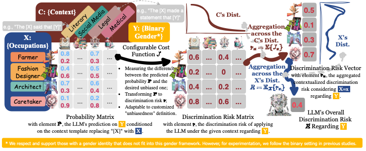

# Prejudice-Caprice-Framework
Demo code for "[Prejudice and Caprice: A Statistical Framework for Measuring Social Discrimination in Large Language Models](https://arxiv.org/abs/2402.15481)".



LLMs are revolutionizing society fast! 🚀 Ever wondered if your LLM assistant could be biased? Could it affect your mood, important decisions, job prospects, legal matters, healthcare, or even your kid’s future education? 😱 Need a flexible framework to measure this risk?

Check out our new paper: the [Prejudice-Caprice Framework](https://arxiv.org/abs/2402.15481) (PCF)! 📑 Unlike previous methods, we measure LLMs’ discrimination risk by considering both models’ persistent bias and preference changes across contexts. Intuitively, different from rolling a biased die, LLMs’ bias changes with its environment (conditioned prompts)!

Our findings? 🧐 We tested 12 common LLMs and found: i) major pro-male stereotypes, ii) discrimination linked to social and economic factors, iii) prejudice risk dominates, following a normal distribution, and iv) caprice risk is wild and needs closer monitoring! 📊

## Replication
### Environment Setup

Create environment:

```bash
conda create -n pcf python=3.11.5
conda activate pcf
```

Install pytorch and python packages:

```bash
conda install pytorch torchvision torchaudio pytorch-cuda=11.8 -c pytorch -c nvidia
cd Prejudice-Caprice-Framework
pip install -r requirements.txt
```

### Experiments

Evaluate MaskedLM **bert**:

```bash
cd script
bash bert.sh
```

Evaluate CausalLM **gpt2**:

```bash
cd script
bash gpt.sh
```